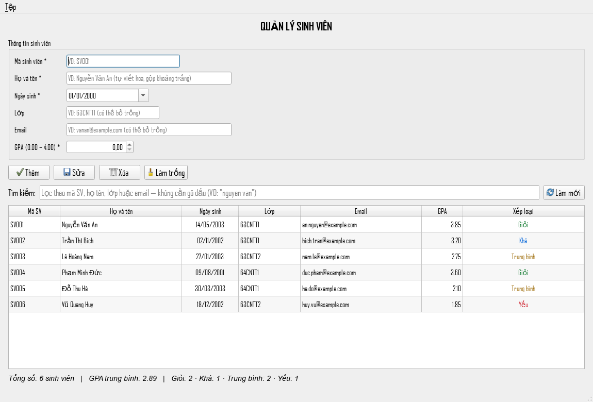

# 🎓 Student Management System (PyQt5)

Ứng dụng quản lý sinh viên viết bằng **Python** và **PyQt5**, lưu dữ liệu trong file CSV.



## ✨ Tính năng

- **Thêm / Sửa / Xóa sinh viên** với thông tin đầy đủ: mã SV, họ tên, ngày sinh, lớp, email, GPA
- **Tìm kiếm không cần gõ dấu**: gõ `nguyen van` vẫn ra "Nguyễn Văn An"; lọc theo mã SV, họ tên, lớp hoặc email
- **Xếp loại học lực tự động** theo GPA thang 4, tô màu ngay trong bảng
- **Thống kê trực tiếp**: tổng số, GPA trung bình, số lượng theo từng xếp loại
- **Nhập / xuất CSV** từ menu *Tệp* — file xuất mở thẳng bằng Excel, không lỗi font
- **Lưu an toàn**: ghi file kiểu nguyên tử (app chết giữa lúc ghi cũng không mất dữ liệu cũ); dòng dữ liệu lỗi được báo rõ thay vì bị bỏ qua âm thầm
- Bảng sắp xếp được theo mọi cột — GPA và ngày sinh sort đúng theo giá trị thật, không phải theo chuỗi
- Tự chuẩn hóa dữ liệu nhập: mã SV tự IN HOA, họ tên tự viết hoa + gộp khoảng trắng thừa, email tự viết thường

## 🛠 Công nghệ

- Python 3.8+ (khuyên dùng 3.9 – 3.13)
- PyQt5 ≥ 5.15 (thiết kế giao diện qua Qt Designer, file `.ui`)

## 🚀 Cài đặt và chạy

```bash
pip install PyQt5
python qlsv.py
```

> 💡 Nếu `pip install PyQt5` lỗi trên Python bản rất mới (3.14+) do chưa có wheel,
> hãy dùng Python 3.9 – 3.13, hoặc cài qua Anaconda: `conda install -c anaconda pyqt`.

## 📁 Cấu trúc project

| File | Vai trò |
|---|---|
| `qlsv.py` | Giao diện và thao tác người dùng (**chạy file này**) |
| `models.py` | Dữ liệu `SinhVien` và quy tắc nghiệp vụ: xếp loại, chuẩn hóa, bỏ dấu |
| `storage.py` | Đọc/ghi CSV an toàn; đường dẫn dữ liệu ghim theo thư mục app |
| `qlsv.ui` | Thiết kế giao diện (Qt Designer) |
| `sv.csv` | Dữ liệu người dùng, tự tạo khi chạy lần đầu (không đưa lên git) |

## 📄 Định dạng `sv.csv`

File lưu theo UTF-8 có BOM (`utf-8-sig`), 6 cột, dòng đầu là tiêu đề:

```csv
ma_sv,ho_ten,ngay_sinh,lop,email,gpa
SV001,Nguyễn Văn An,2003-05-14,63CNTT1,an.nguyen@example.com,3.85
```

- File **định dạng cũ 3 cột** (`ma_sv,ho_ten,gpa`) vẫn đọc được bình thường; lần ghi kế tiếp sẽ tự nâng lên 6 cột.
- Dòng sai định dạng (thiếu cột, GPA ngoài 0–4, ngày sinh lạ…) sẽ được báo kèm **số dòng và lý do** khi mở app, không bị nuốt im lặng.
- Mở/chỉnh trực tiếp bằng Excel được: nhớ lưu lại dưới mã **UTF-8**.

## 🏷 Xếp loại học lực (GPA thang 4)

| GPA | Xếp loại |
|---|---|
| ≥ 3.60 | Giỏi |
| ≥ 3.00 | Khá |
| ≥ 2.00 | Trung bình |
| < 2.00 | Yếu |

## ⌨️ Phím tắt

| Phím | Thao tác |
|---|---|
| `Ctrl+N` | Thêm |
| `Ctrl+U` | Sửa sinh viên đang chọn |
| `Delete` | Xóa sinh viên đang chọn (khi bảng đang focus) |
| `Ctrl+L` | Làm trống form |
| `F5` | Làm mới dữ liệu từ `sv.csv` |
| `Ctrl+I` / `Ctrl+E` | Nhập / xuất CSV |
| `Ctrl+Q` | Thoát |

Nhập form xong bấm **Enter** để sang ô kế tiếp; Enter ở ô GPA sẽ gửi form —
tự động **Sửa** nếu mã SV đang nhập đã tồn tại, **Thêm** nếu là mã mới.

## 💡 Ghi chú

- Ngày sinh không thể chọn ngày trong tương lai.
- Dialog xác nhận xóa mặc định là **No** — bấm nhầm Enter không mất dữ liệu.
- Dữ liệu là file cục bộ, đừng commit `sv.csv` lên git (đã có trong `.gitignore`).
